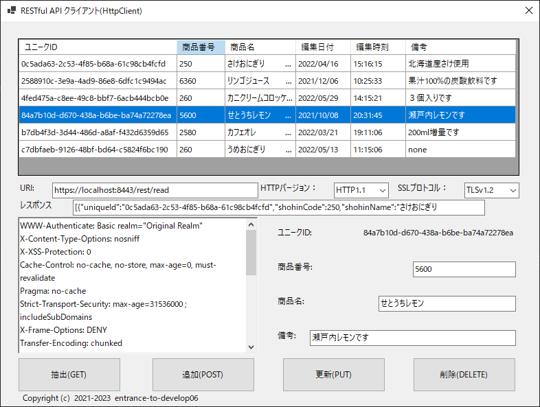
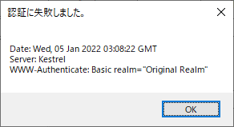

### :computer: JSON形式でHTTPS通信するRESTクライアント(WindowsForms)

## 開発環境  

```
統合開発環境：Microsoft Visual Studio 2022 Community Edition 17.5.5  
プログラム言語：C#.NET 10  
フレームワーク：.NET 6.0.16  
開発SDK：.NET SDK 6.0.408  
デスクトップ：Windows Forms  
NuGetライブラリー：Microsoft.Extensions.DependencyInjection 7.0.0  
                  Microsoft.Extensions.Http 7.0.0  
```

#### 画面イメージ  
  

#### 認証画面  
  

#### 認証失敗時  
  

___