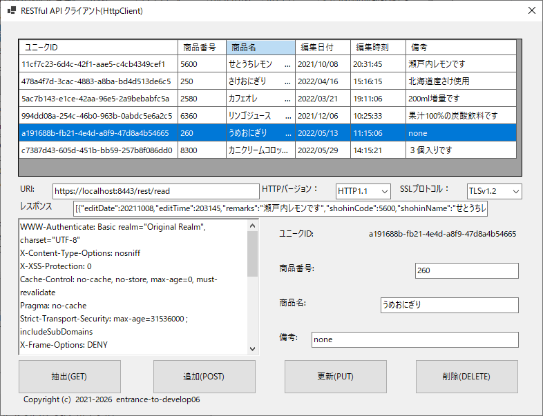
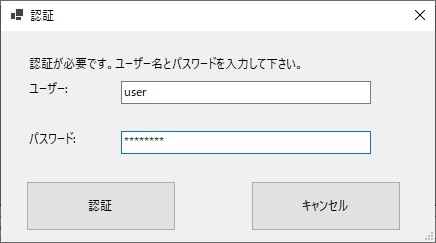
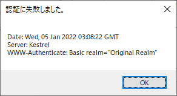

### :computer: JSON形式でHTTPS通信するRESTクライアント(WindowsForms)

## 開発環境  

```
統合開発環境：Microsoft Visual Studio 2026 Community Edition 18.9.2  
プログラム言語：C#.NET 14  
フレームワーク：.NET 10.0.11  
開発SDK：.NET SDK 10.0.400  
デスクトップ：Windows Forms  
NuGetライブラリー：Microsoft.Extensions.DependencyInjection 10.0.11  
                  Microsoft.Extensions.Http 10.0.11  
```

#### 画面イメージ  
  

#### 認証画面  
  

#### 認証失敗時  
  

___